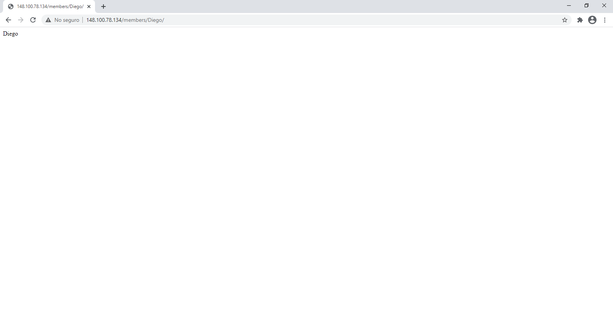
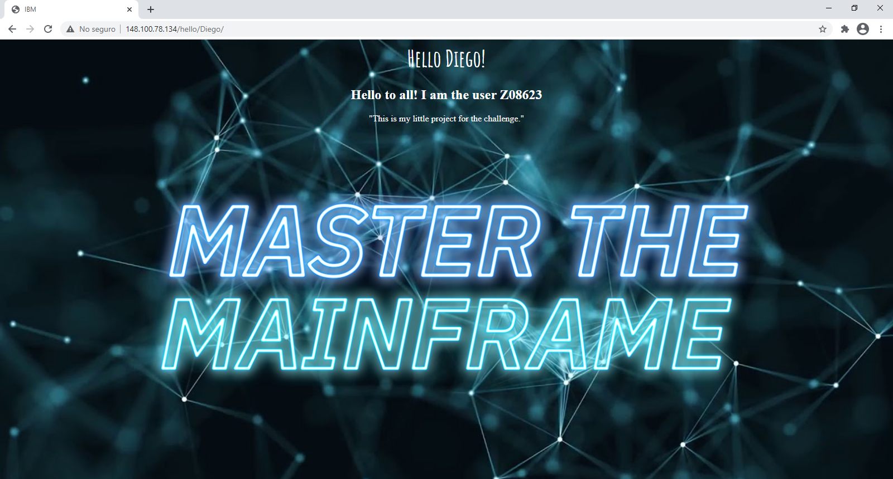

# IBM MTM2020 - The Grand Challenge

### Summary 

**Title:**
Send a greeting

**Notes:**
It is a Rest API developed in `python` using the `Flask` using a `Nginx` load balancer to redirect the traffic. The application is deployed on a Centos 8 Linux server.

**Directions:**
API rest:
- http://148.100.78.134/members/{name}
- http://148.100.78.134/hello/{name}

Replace `name` with your name.

 
 

### Screenshots

